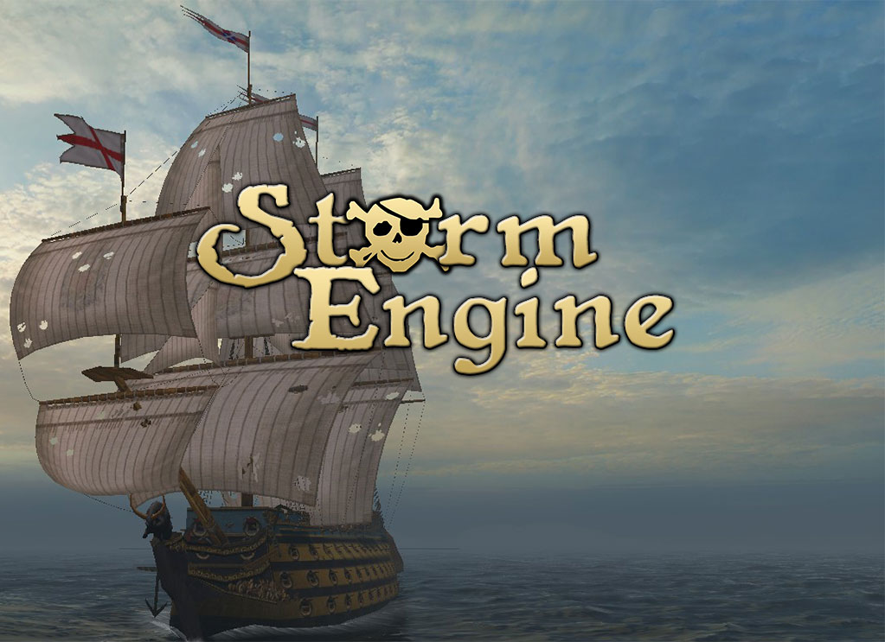

# Storm Engine Knowledge Base

Welcome to the Storm Engine Knowledge Base!

Storm Engine has been initially developed by studio Akella for the game [Sea Dogs](https://en.wikipedia.org/wiki/Sea_Dogs_(video_game)). The engine has evolved since 2000 to run other games of the series. It was open-sourced under the [GPL-3.0 License](https://choosealicense.com/licenses/gpl-3.0/) on [March 25, 2021](https://steamcommunity.com/games/223330/announcements/detail/3013444995188538671).

This knowledge base will eventually cover most aspects of the engine: engine, currently available tools, and modding. You will also find here some trivia and additional notes.

---

## Index

### Engine Architecture

* Overview

---
### Tools & Plugins

Modding Tool
Animation View
Model View
Particles Editor
Scripts Hider
Texture Converter
Walk Patcher

Maya Exporter

---
### Modding

---

### Trivia

[History of the Engine](kb/0001-history.md)

---

---

| [Home](index.md) | [Site Map](site-map.md) | 