# History of the Engine
_[back to Index](../index.md)_

**Related articles**: Changelog

_The following recount is partially based on anecdotal evidence, collected throughout the Russian web._ 

This article doesn't include engine changes and updates since its open source release.

## Storm 1.0

The first version of the Storm Engine was developed for the game _Sea Dogs_ by a small team led by Dmitry Demyanovski ([full credits](https://www.mobygames.com/game/sea-dogs)). The game had the following features:

> A 3D engine that features various wind, wave, and weather conditions is the primary interface, as you navigate into harbors and engage enemies. Little nuances include patrolling sharks and circling seagulls, as well as visual damage to both hull and sails of each vessel. Walking about town is also done in 3-D and you'll have to remember what streets hold what stores if you wish to just make a quick stop. 

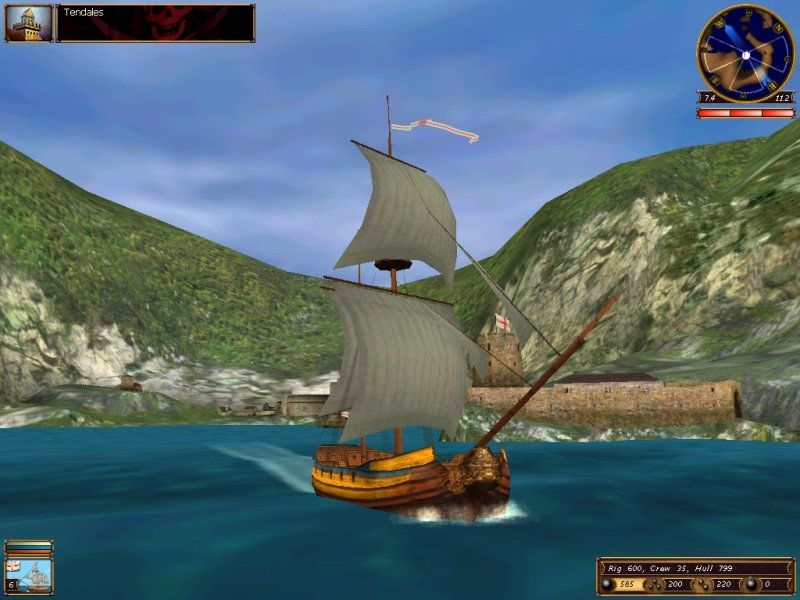
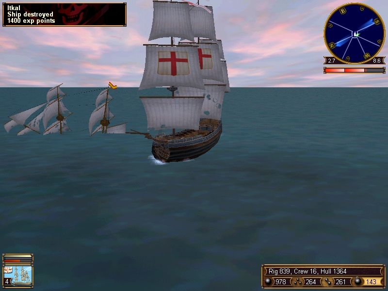
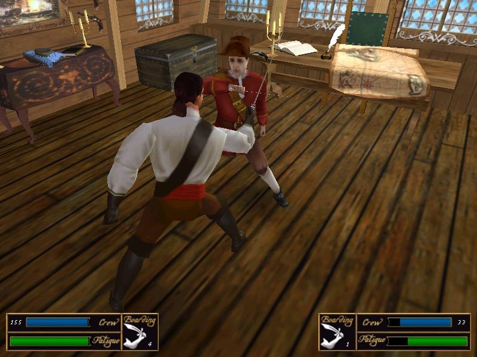

## Storm 2.0

Version 2.0 of the engine was initially worked on for _Sea Dogs 2_. However, due to the game's rebranding for the _Pirates of the Caribbean_ franchise development team got more time to improve the engine. As a result, the following updates made it for the game's 2003 release: 

* New lighting system
* Ship reflections at sea
* Animated grass
* Engine optimizations
* Etc.

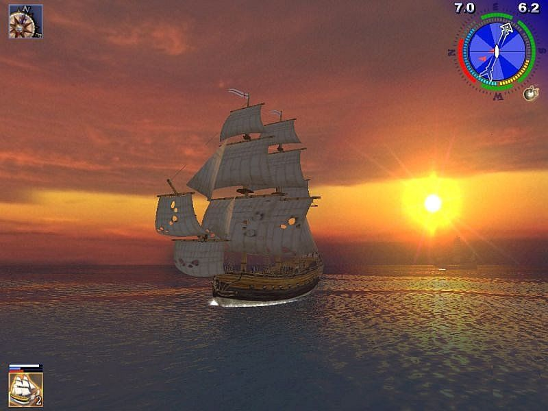
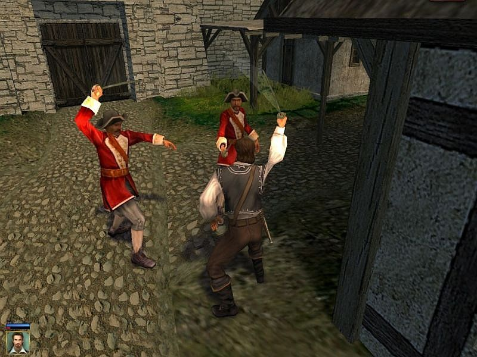
 

## Storm 2.5

In 2005, with the _Age of Pirates: Caribbean Tales_, we've got:

* Procedural sea
* New grass shaders
* New particle effect toolsets
* New skybox with procedural stars and planets
* Sea foam and wake
* Other optimizations

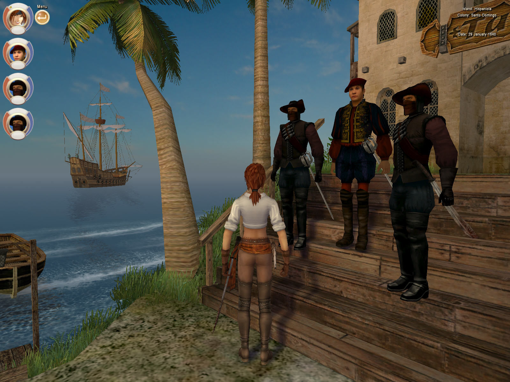
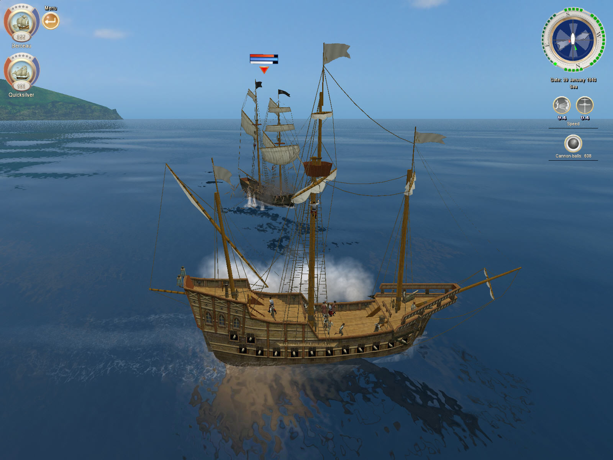
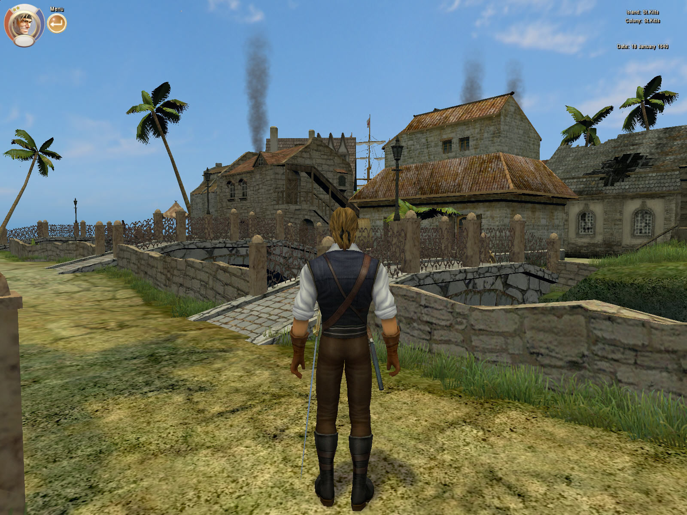

## Storm 2.6-7

More work on the Storm Engine was done for the CT expansion _Dead Man's Chest_. 

* Dynamic day/night cycle (with stellar object movement)
* Procedural island generation with jungle sprites
* Expanded scripting language
* Blood and rain splatters (on surfaces and characters)
* Updated shadow blending
* Dynamic lighting
* Landscape and town reflections on sea
* More optimizations

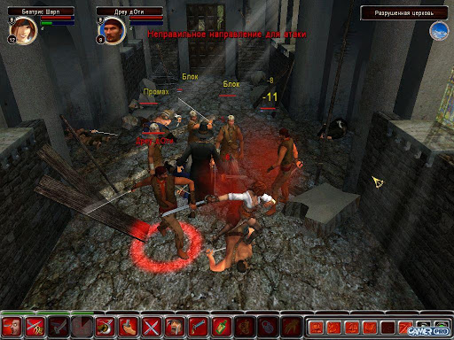

_Dead Man's Chest_ was developed by Akella separately from City of Abandoned Ships (built by Seaward). While it was the most unusual addon of the series, for multiple reasons it wasn't successful, and the sources of its engine are likely lost. 

## Storm 3.0

Historically, Storm Engine version 3.0 was never released, although some of the developments of the new engine were integrated in the previous version as the new games were coming out. For all intents and purposes, this project was abandoned and its source code isn't part of this repository.

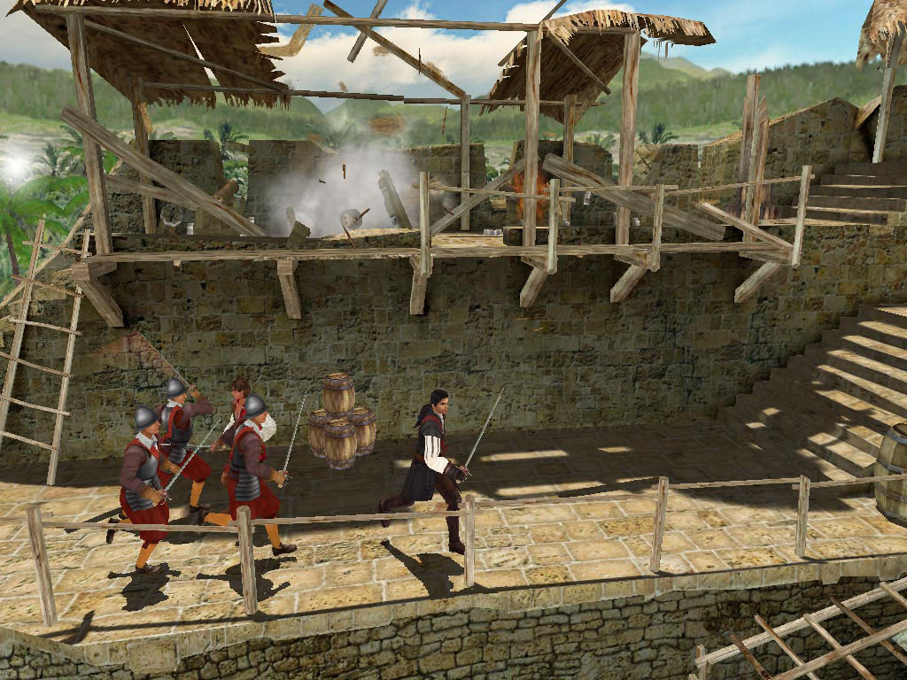

## Storm 2.8

Version 2.8 was developed for the late 2007 release of _Age of Pirates 2: City of Abandoned Ships_. Among other things, it featured a more complete developer toolkit with an ingame editor. A toolbar with the buttons allowed game designers and testers edit the character and locations.

* Weather effects can be seen from inside the buildings
* Rain splatters on sea
* Updated effects blood and smoke
* Rewritten weather and lighting settings
* Updated sea for viewing from below
* New location type for underwater adventures
* Water refraction
* Water caustics
* Volumetric light under water
* Updated animation system to avoid clipping into the geometry
* More AI improvement
* More optimization and bugfixing

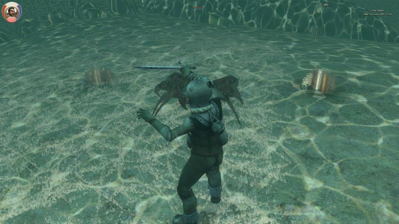
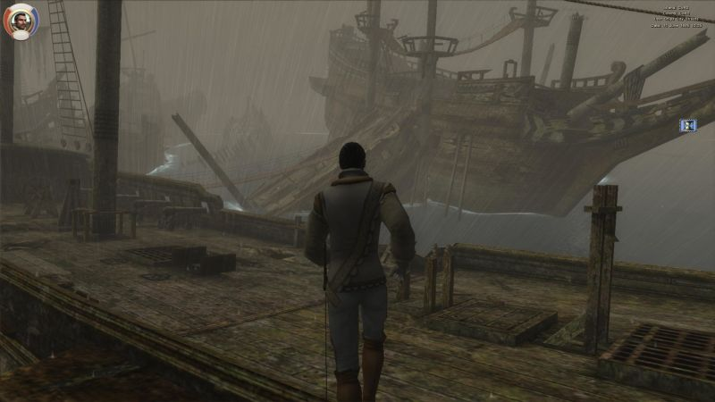

## Storm 2.9

Storm Engine 2.9 was released in 2016 with an update to _Sea Dogs: To Each His Own_. It had many updates aimed at refreshing the ageing engine, including widescreen support, Steam API integration and higher resolution support.

* DirectX 9
* Better save file handling
* Better combat AI
* Engine rebuilt with MSVS 2019
* Newest version of fmod sound engine implemented;
* Many other tweaks

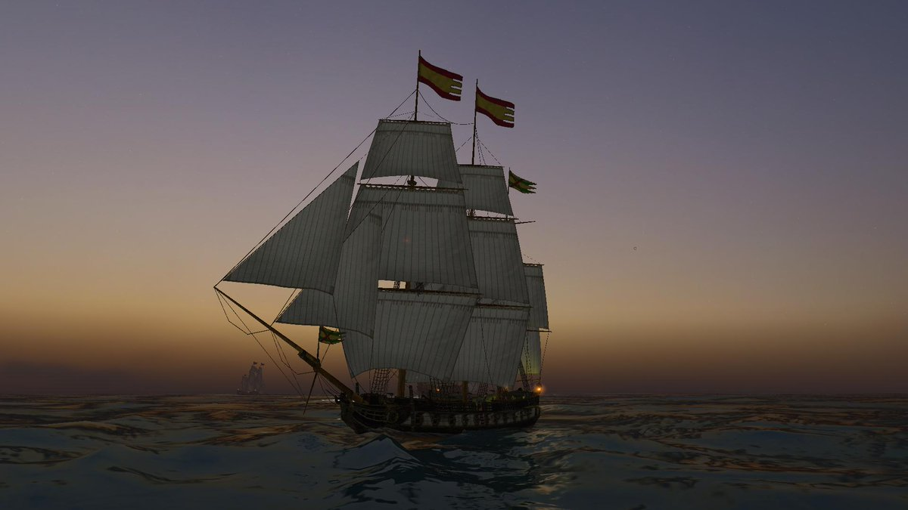

---

Sources: 

* [History of the brand "Sea Dogs," or the Lost Manuscripts.](http://forums.corsairs-harbour.ru/showthread.php?t=1288)
* [Evolution of the Storm](http://www.seaward.ru/forum/index.php?showtopic=8599) (copy of this document is also available [here](https://github.com/storm-devs/sd-teho-public/blob/steamapi-isolate/docs/storm_evolution.txt)). 
* [Sea Dogs Credits](https://www.mobygames.com/game/sea-dogs)

---

| [Home](../index.md) | [Site Map](../site-map.md) | 