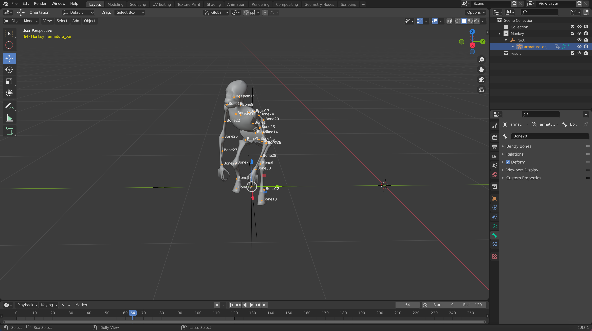
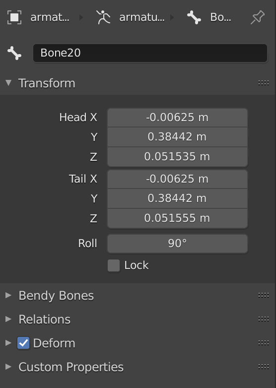

# Blender AN export

## Экспорт .an из Blender
Выбрать объект со скелетом



```
File -> Export... -> AN Export(.an)
```

Для корректной работы экспортированной анимации кости скелета должны быть очень маленькими (размеры стремиться к точке)

Координаты по X и Y должны быть одинаковыми, Z отличаться на 0.00001.
Также Roll должен быть 90°



В игре учитываются изменения location только у root кости

Углы можно менять у всех костей (значения ОБЯЗАТЕЛЬНО должны быть указаны в кватернионах)


## Установка плагина в Blender
```
Edit -> Preferences... -> Add-ons -> Install... -> Выбрать export_an.py из папки io_export_an -> Включить "Export: SeaDogs AN"
```

## Автор

[Artess999](https://github.com/Artess999)

