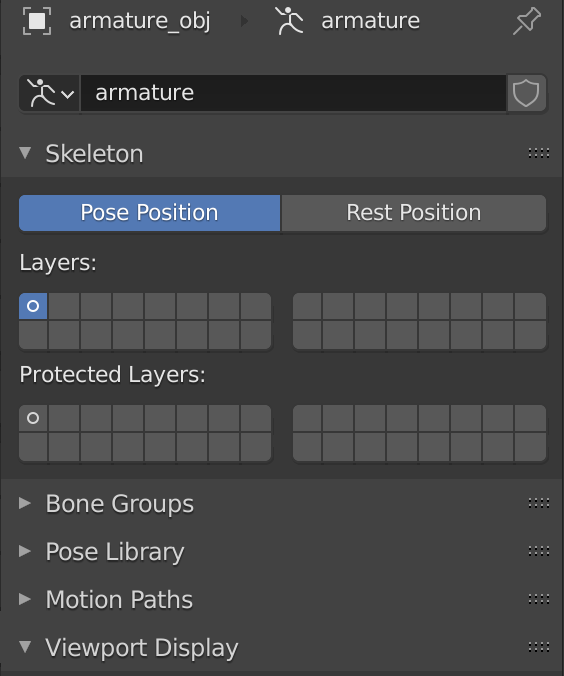
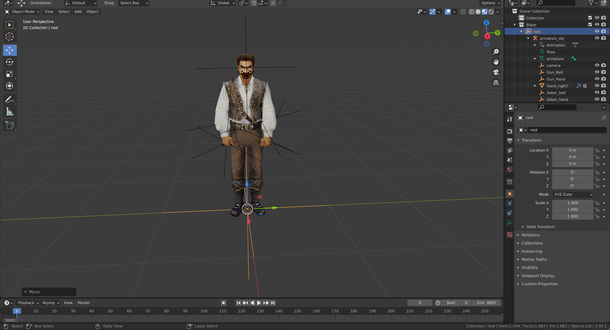
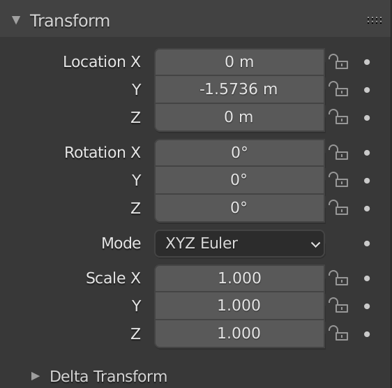
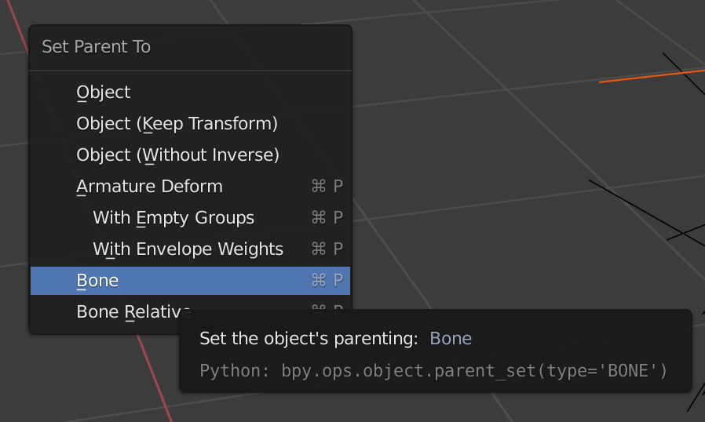
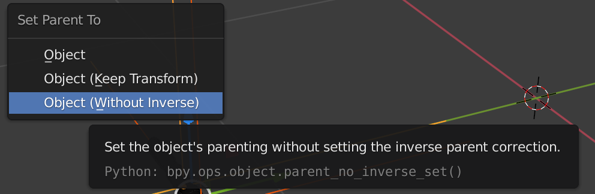
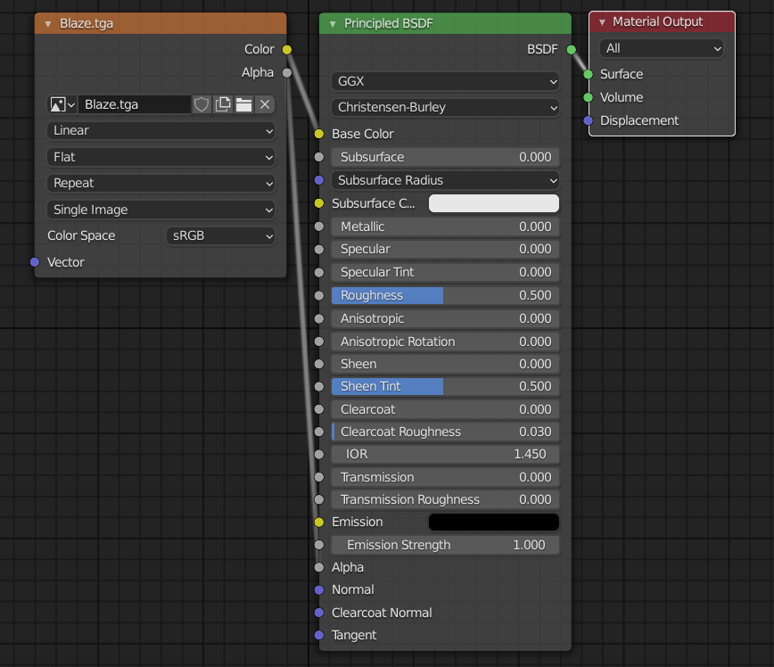
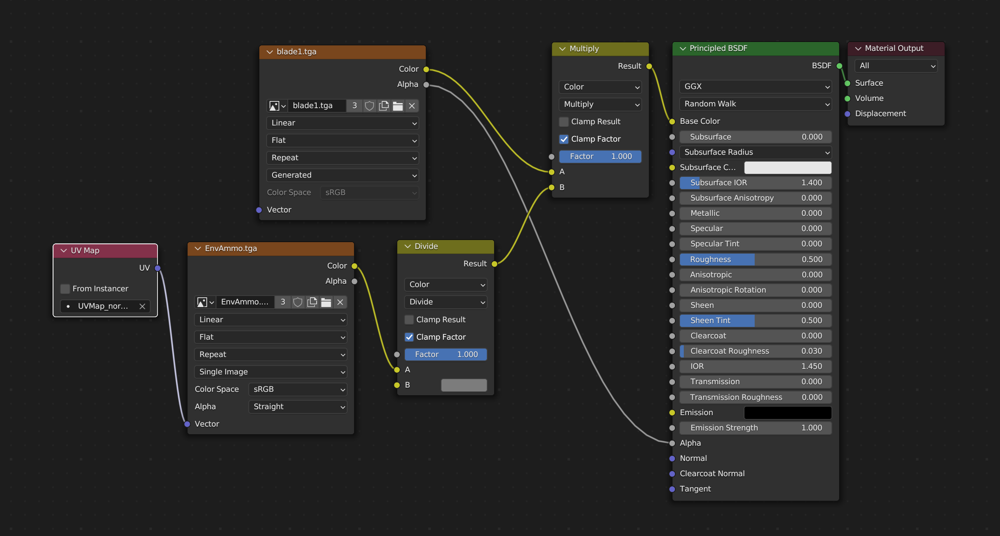

# Blender GM export

[Русская версия Readme](README_RUS.md)

## Export .gm Blender

If model has armature, it must be in pose position



All meshes must be triangulated

Select root locator



```
File -> Export... -> GM Export(.gm)
```

The game supports 65,535 vertices in one mesh.
It is possible that some vertices might be duplicated because of Blender data representation.
The optimal would be 40,000 - 50,000 vertices per mesh (might be more, it depends on the model)

Mesh can be split into multiple meshes if it has more vertices than supported.

The correct structure example (locators, meshes, textures, UV, shading) is presented on imported models

### Locators and meshes

All locators with children must have zero rotation



If locator is parented to bone it must be parented this way



If locator or mesh is parented to other locator it must be parented this way



### Textures

Textures must be in .tga format

On animated models might be only one texture.
If you want multiple textures on the character, you need to add additional object
with a separate texture (e.g., characters with cuirass)

On models without animation might be one or two textures (main texture and texture with normals / decals - for e.g, ammo)

### Nodes structure

1) One texture




2) Two textures



## Blender Plugin Installation
```
Edit -> Preferences... -> Add-ons -> Install... -> Select export_gm.py from io_export_gm folder -> Enable "Export: SeaDogs GM"
```

## Blender Usage
```
File -> Export... -> GM Export(.gm)
```

## Issues

Export with BSP is very slow in Blender, so I've made bsp-patcher.exe utility.
It is preferable to use it when exporting with BSP

[bsp-patcher](../bsp-patcher)

## Author

[Artess999](https://github.com/Artess999)

