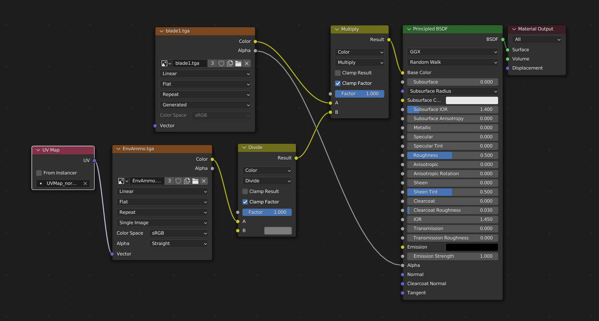

# Blender GM export

## Экспорт .gm из Blender

Если у модели есть арматура, она должна быть в pose position


Все объекты должны состоять из треугольников

Выбрать корневой локатор


```
File -> Export... -> GM Export(.gm)
```

В игре в одном меше поддерживается 65 535 вертексов.
Из-за особенностей экспорта возможно, что часть вертексов будет продублирована.
Оптимальным будет 40 000 - 50 000 вертексов в одном меше (может быть и больше, зависит от исходной модели)

Если в меше больше вертексов, можно разделить его на несколько мешей

Корректную структуру (локаторы, меши, текстуры, uv, шейдинг) можно посмотреть на импортированных из игры моделях

### Локаторы и меши

Все локаторы, являющиеся родительскими (к ним прикреплены другие локаторы / объекты) должны иметь нулевое вращение


Если локатор присоединяется к кости (устанавливается родитель), то он должен быть присоединен следующим образом


Если локатор или меш присоединяется к другому локатору (устанавливается родитель), то он должен быть присоединен следующим образом


### Текстуры

Текстуры должны быть в формате .tga

На анимированных моделях поддерживается только одна текстура.
Если необходимо несколько текстур на персонаже, необходимо добавлять доп. объект 
с отдельной текстурой (пример - персонажи с кирасами)

На моделях без анимации поддерживается одна текстура, либо две (основная и текстура с нормалями/декали - пример - оружие)

### Структура нод для корректной выгрузки текстур

1) Одна текстура
   


2) две текстуры



## Установка плагина в Blender
```
Edit -> Preferences... -> Add-ons -> Install... -> Выбрать export_gm.py из папки io_export_an -> Включить "Export: SeaDogs GM"
```

## Автор

[Artess999](https://github.com/Artess999)

