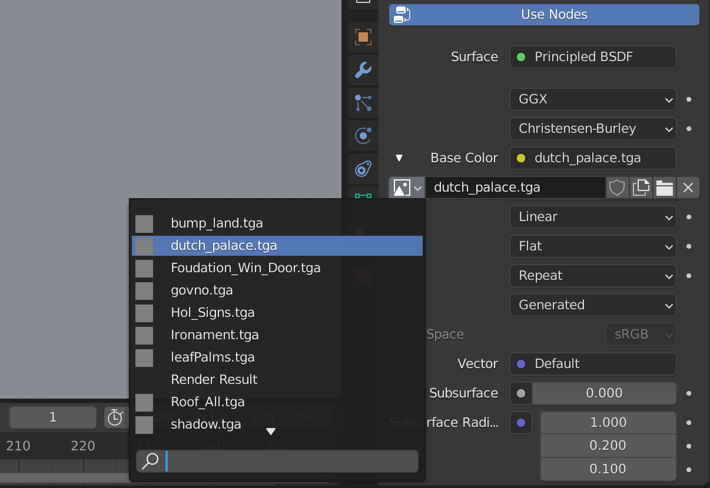

# Blender GM import

[Русская версия Readme](https://github.com/storm-devs/storm-engine/blob/develop/tools/blender-gm-import/README_RUS.md)

## Requirements

In order to use this plugin you need:

- models in .gm format and textures in .tga format

The textures must be in ``textures`` subfolder in the same folder as the model.
E.g.:
```
C/
    example-folder/
        model.gm
        textures/
            texture1.tga
            texture2.tga
```

In case of missing texture in Blender will be created gray-colored placeholder with missing texture name



## Model import with animation

To import model with animation, you have to add a file with animation (.an) to the same folder as the model

E.g.:
```
C/
    example-folder/
        model.gm
        man.an
```

Then during import setup you must specify animation file in the field `Animation name`


## Blender Plugin Installation
```
Edit -> Preferences... -> Add-ons -> Install... -> Select import_gm.py from io_import_gm folder -> Enable "Import: SeaDogs GM"
```

## Blender Usage
```
File -> Import... -> GM Import(.gm)
```

The textures must be in ``textures`` subfolder in the same folder as the model.
E.g.:
```
C/
    example-folder/
        model.gm
        textures/
            texture1.tga
            texture2.tga
```

## Author

[Artess999](https://github.com/Artess999)

