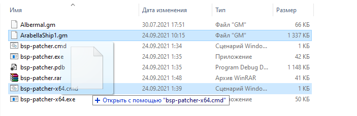
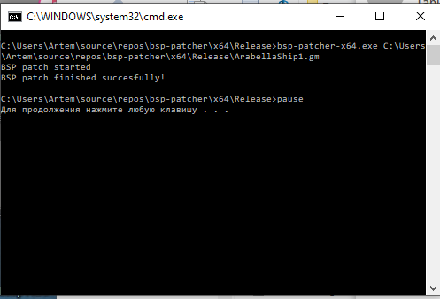

# BSP patcher

Для добавления BSP необходимо перетащить .gm на .cmd

Затем, когда BSP будет добавлено появится сообщение `BSP patch finished succesfully!`

## Автор

[Artess999](https://github.com/Artess999)
Nick Chirkov (original BSP code)

